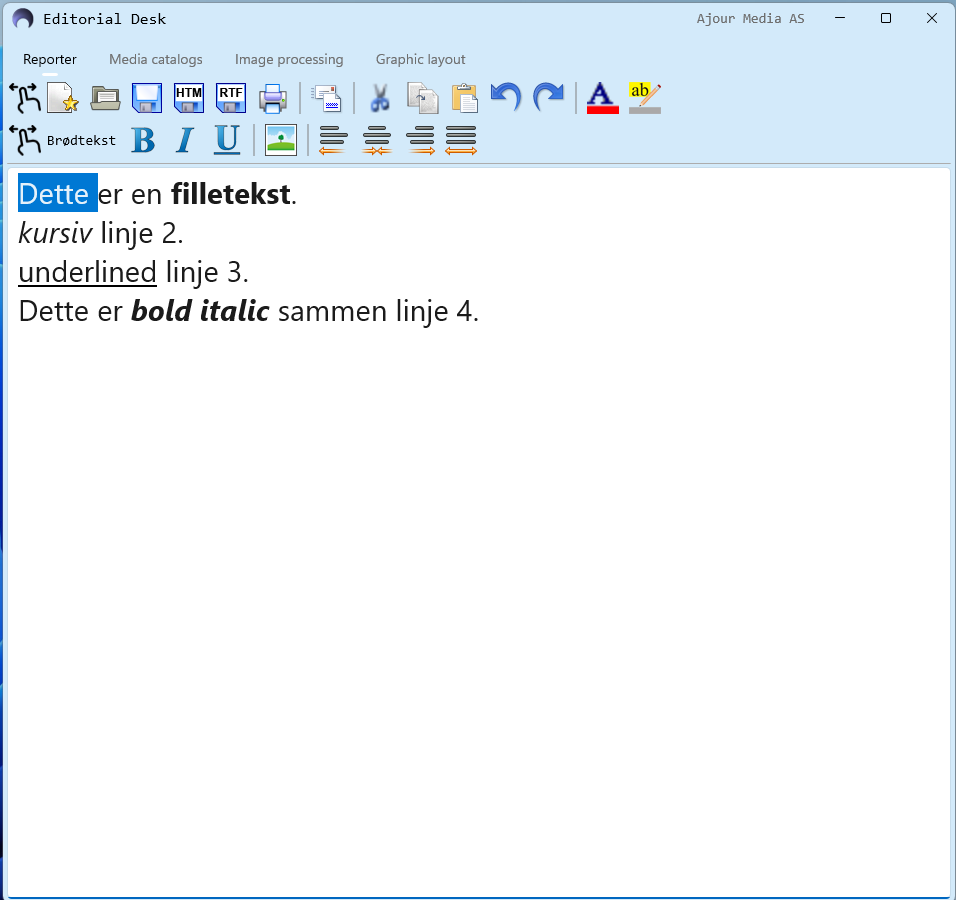
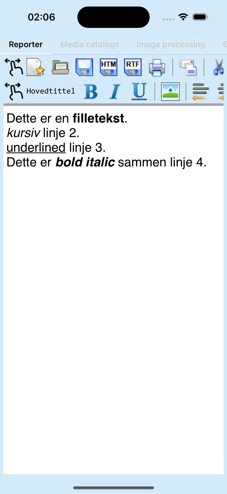

#  Maui Cross platform Editor-library<br/>for HTML, XML and RTF.[^1]

## Editorial tool to produce articles and reportage for use in newspapers, online newspapers, TV or radio.

### Supported platforms: Windows, MacOS, iOS and Android. Default languages: Norwegian, English y Español.

#### NB! This is a very early phase of a project that is planned to run throughout 2025. Input and ideas will be gratefully received.
#### Module 1: Write articles, copy html from web pages, import rtf and html documents from emails.
#### Module 2: Texts, images and videos are linked to the article from here.
#### Module 3: Choosing the image section, correct resolution, light and contrast.
#### Module 4: Format/design the article with text and images to the desired layout for print, web and mobile.

### PROJECT: TESTE AJOUR EDITOR Library
1. Create a new MAUI Application
2. Add Nuget package [Ajour.EditorLib.1.4.xx.nupkg]()<br/>
2a. copy to your offline packages folder, then add to your project.
3. Open **MauiProgram.cs**<br/>
3a. Add [using Ajour.EditorLib;]()<br/>
3b. Add [builder.UseAjourEditor();]()
4. Open **MainPage.xaml**<br/>
4a. Add [xmlns:ajourlib="clr-namespace:Ajour.EditorLib;assembly=Ajour.EditorLib"]()<br/>
4b. Replace sample content with [<ajourlib:AjourEditor />]()
5. Open **MainPage.xaml.cs**<br/>
5.a remove sample source
6. Build and run






### TODO:
- [x] **Save As RTF** fileformat from Windows, iOS and MacOS. (Limited to one style template).
- [x] Open .rtf files from Windows, iOS and MacOS  (v1.4.36)
- [x] Click the Open File button **testfil2 med bilder**.html (v1.4.30)
- [x] Text Styles: Type some text and click **B**, **I** eller **U** (v1.4.21)

**Task 1:** 
- Open an html page in the editor as an editable document.
- Save the document to your local hard drive as **html** or **rtf** file format.

**Task 2:** 
- Load a web page from your web browser. **Highlight** the content you are interested in and **copy** it to the clipboard.
- Click the **Paste** button in the editor to **edit the content** from the web page as an **editable document**.
- The document is now completely independent of the web page you copied it from. You can edit it as you wish and save the result to your local hard drive as **html** or **rtf** file format.

[^1]: Copyright © 1991 - 2025 Ajour Media AS.

```cs
using Microsoft.Extensions.Logging;
using CommunityToolkit.Maui;
using Ajour.EditorLib;
namespace TestAjourEditor
{
    public static class MauiProgram
    {
        public static MauiApp CreateMauiApp()
        {
            var builder = MauiApp.CreateBuilder();
            builder
                .UseMauiApp<App>()
                .UseMauiCommunityToolkit()
                .ConfigureFonts(fonts =>
                {
                    fonts.AddFont("OpenSans-Regular.ttf", "OpenSansRegular");
                    fonts.AddFont("OpenSans-Semibold.ttf", "OpenSansSemibold");
                })
                .UseAjourEditor();

            #if DEBUG
            builder.Logging.AddDebug();
            #endif

            builder.Services.AddSingleton<DesktopWindow>();

            return builder.Build();
        }
    }
}
```

```xhtml
<?xml version="1.0" encoding="utf-8" ?>
<ContentPage 
    xmlns="http://schemas.microsoft.com/dotnet/2021/maui"
    xmlns:x="http://schemas.microsoft.com/winfx/2009/xaml"
    x:Class="TestAjourEditor.MainPage"
    xmlns:ajourlib="clr-namespace:Ajour.EditorLib;assembly=Ajour.EditorLib"
    >
    <!-- Editor -->
    <ajourlib:AjourEditor />
</ContentPage>
```


**Android Required:**
```xhtml
XML
<uses-permission android:name="android.permission.READ_EXTERNAL_STORAGE" android:maxSdkVersion="32" />
<uses-permission android:name="android.permission.WRITE_EXTERNAL_STORAGE" android:maxSdkVersion="34" />
<!-- Required only if your app needs to access images or photos that other apps created -->
<uses-permission android:name="android.permission.READ_MEDIA_IMAGES" />
<!-- Required only if your app needs to access videos that other apps created -->
<uses-permission android:name="android.permission.READ_MEDIA_VIDEO" />
<!-- Required only if your app needs to access audio files that other apps created -->
<uses-permission android:name="android.permission.READ_MEDIA_AUDIO" />
```


**iOS/Mac Catalyst Required:**
```plist
Info.plist
<key>com.apple.security.assets.movies.read-only</key>
<true/>
<key>com.apple.security.assets.music.read-only</key>
<true/>
<key>com.apple.security.assets.pictures.read-only</key>
<true/>
<key>com.apple.security.files.downloads.read-only</key>
<true/>
<key>com.apple.security.personal-information.photos-library</key>
<true/>
```


**Mac Catalyst Required:**
```plist
Entitlements.plist
<key>com.apple.security.files.user-selected.read-write</key>
<true/>
```


**Windows Required:**
```
SDK-version 10.0.22621.0
- No setup is required.
```

**Optional: MacCatalyst and Windows**
```cs
#if MACCATALYST
builder.Services.AddSingleton<AppTitleCatalyst>();
#endif
#if WINDOWS10_0_22621_0_OR_GREATER
builder.Services.AddSingleton<AppTitleWinUI>();
#endif
builder.Services.AddSingleton<ReporterPage, ReporterViewModel>();

private readonly IServiceProvider? services;
public App(IServiceProvider services)
{
    InitializeComponent();
	this.services = services.GetService<IServiceProvider>();
}

protected override Window CreateWindow(IActivationState? activationState)
{
	if (DeviceInfo.Current.Platform == DevicePlatform.WinUI ||
		DeviceInfo.Current.Platform == DevicePlatform.MacCatalyst)
	{
		Window? window = null;
		if (DeviceInfo.Current.Platform == DevicePlatform.WinUI)
		{
			window = services?.GetService<AppTitleWinUI>()!;
			window.Page = new StartupWinUI();
		}
		else
		{
			window = services?.GetService<AppTitleCatalyst>()!;
			window.Page = new StartupCatalyst();
		}
		window.Created += (sender, args) =>
		{
			Window? window = sender as Window;
			if (window != null)
			{
				string? position = Microsoft.Maui.Storage.Preferences.Get("Position", null);
				if (position != null)
				{
					string[] array = position.Split(";".ToCharArray());
					var bounds = new Rect(
						new Point(Convert.ToDouble(array[0]), Convert.ToDouble(array[1])),
						new Size(Convert.ToDouble(array[2]), Convert.ToDouble(array[3])));
					if (bounds.Width > 0 && bounds.Height > 0)
					{
						window.X = bounds.Left;
						window.Y = bounds.Top;
						window.Width = bounds.Width;
						window.Height = bounds.Height;
					}
				}
			}
		};
		window.Destroying += (sender, args) =>
		{
			Window? window = sender as Window;
			if (window != null)
			{
				string position = String.Format("{0};{1};{2};{3}",
					Convert.ToInt32(window.X),
					Convert.ToInt32(window.Y),
					Convert.ToInt32(window.Width),
					Convert.ToInt32(window.Height));
				Microsoft.Maui.Storage.Preferences.Set("Position", position);
			}
		};
		return window;
	}
	else
	{
		return new Window(new StartupMobile());
	}
}
```

